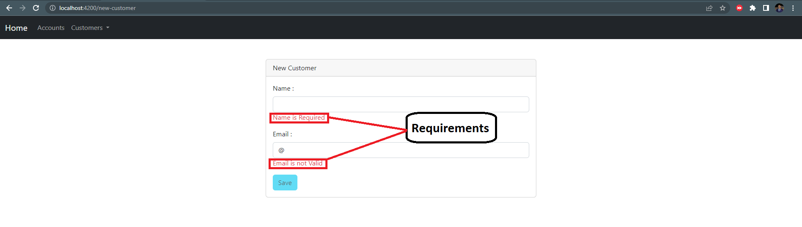

<h1 align="center">Partie Frontend</h1>
 

Ce document présente la composante utilisateur de l'application web Digital Banking, conçue à l'aide du cadre de développement Angular. Cette plateforme offre diverses capacités permettant la gestion des transactions bancaires sur Internet, englobant l'accès aux relevés de compte, l'administration des clients ainsi que les opérations financières incluant des débits, des crédits et des transferts de fonds.

# Partie Customers

La composante "Clients" se subdivise en deux catégories distinctes : l'affichage des clients déjà enregistrés et l'ajout de nouveaux bénéficiaires.
### -Consultation des clients

Dans cette catégorie, les informations relatives aux clients déjà présents sont répertoriées. Une fonctionnalité de recherche par mot-clé est mise à disposition, facilitant ainsi le filtrage des clients. Chaque client est présenté sous forme d'une entrée dans un tableau, comprenant des détails tels que l'identifiant, le nom et l'adresse e-mail. Deux options sont proposées : l'élimination du client ou l'accès à ses comptes, accessibles à l'aide de boutons dédiés.
 

 

### -Supprimer le client

 

### - Ajout de nouveaux clients

Dans cette partie, les utilisateurs ont la possibilité d'intégrer de nouveaux clients dans l'application. Une interface présente un formulaire comprenant les champs indispensables, tels que le nom et l'adresse e-mail. Des vérifications sont réalisées sur ces champs afin de garantir l'exactitude des données fournies. Pour enregistrer le nouveau client, l'utilisateur n'a qu'à cliquer sur le bouton "Enregistrer".

 

### - les requis

 

### -l'ajout

 

# Comptes bancaires et opérations

La fonctionnalité des comptes bancaires offre la possibilité d'accéder aux détails d'un compte précis ainsi que d'effectuer diverses transactions financières.

 

Cette section se divise en deux parties distinctes :

- La première partie met en évidence les informations relatives au compte bancaire spécifique, incluant son identifiant unique et le solde disponible. Elle présente également un historique des opérations effectuées sur ce compte, en indiquant leur identifiant, leur date, leur type et leur montant.

- La seconde partie offre à l'utilisateur la possibilité d'effectuer des transactions financières sur le compte sélectionné. Différentes options sont proposées, telles que le débit, le crédit et le transfert. Si l'option de transfert est choisie, un champ supplémentaire apparaît pour spécifier le compte de destination. L'utilisateur est également invité à entrer le montant de l'opération ainsi qu'une brève description. Une fois ces informations saisies, il peut enregistrer l'opération en cliquant sur le bouton approprié.

 

### -DEBIT

 

### -CREDIT

 

### -TRANSFER

 

# Conclusion

Cette analyse a couvert la composante frontend de l'application web Digital Banking, élaborée en utilisant le framework Angular. L'interface utilisateur offre aux utilisateurs la possibilité de parcourir les clients enregistrés, d'ajouter de nouveaux bénéficiaires, de visualiser les informations détaillées des comptes bancaires, de consulter l'historique des opérations effectuées et d'effectuer de nouvelles transactions financières telles que les débits, les crédits et les transferts. Cette application garantit une expérience ergonomique pour gérer efficacement et en toute sécurité les opérations bancaires en ligne.
